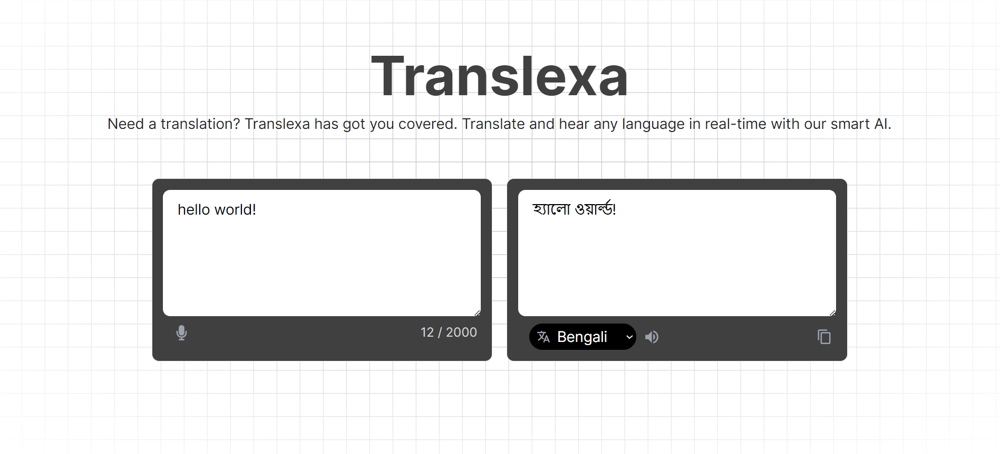

# Translexa: Your Personal Translator

Translexa is a powerful AI-driven language translation app built with Next.js. It allows users to translate any language and hear the translations spoken back in the target language. Translexa makes global communication seamless and effortless.



## Features
- **Instant Translation**: Translate any language instantly.
- **Voice Output**: Hear the translations spoken in the target language.
- **User-Friendly Interface**: Easy to use and navigate.

## Technologies Used
- **Frontend**: React.js, Next.js, Tailwind CSS, Aceternity UI
- **AI Integration**: Gemini API

## Getting Started

To get a local copy up and running, follow these simple steps.

### Prerequisites

Make sure you have the following installed:

- Node.js
- npm (Node Package Manager) or yarn

### Installation

1. Clone the repository:
```sh
git clone https://github.com/jeesun09/Translexa.git
```
2. Navigate to the project directory:
```sh
cd translexa
```
3. Install the dependencies:
```sh
npm install
# or
yarn install
```
4. Run the development server:
```sh
npm run dev
# or
yarn dev
```
5. Open your browser and navigate to `http://localhost:3000` to see the app in action.